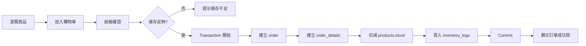
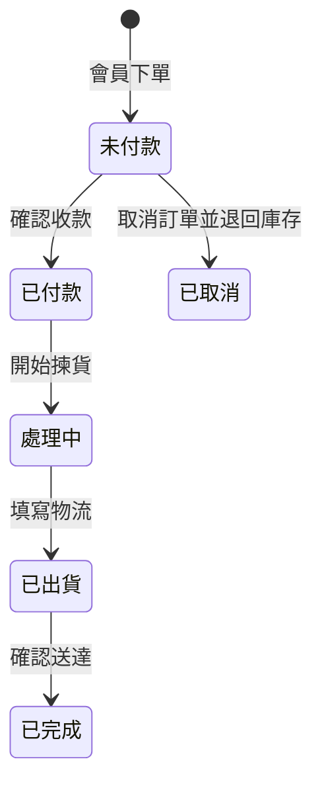

# 電商訂單與庫存管理系統 — UI 設計規格

> 依據《資料庫計劃書》整理 · 組員：陳昇宏、夏承冠、賴威凱、蘇綵蓁  
> 版本：v1.0 · 2026-05-17

---

## 1. 設計目標與定位

| 項目 | 說明 |
|------|------|
| **產品定位** | 中小型電商／個人網拍工作室的「營運後台 + 會員購物前台」 |
| **核心價值** | 訂單與庫存連動、狀態可追蹤、資料一致（防超賣） |
| **設計原則** | 結構清晰（教學導向）、功能完整但不臃腫、資訊層級分明 |
| **參考標的** | 介於 Shopee 複雜後台與簡易購物車之間的「輕量專業版」 |

---

## 2. 使用者角色

```
┌─────────────────────────────────────────────────────────┐
│                      系統使用者                          │
├─────────────────────┬───────────────────────────────────┤
│  管理者 (Admin)      │  會員 (Member)                     │
│  · 商品／分類維護    │  · 註冊／登入                      │
│  · 訂單處理與狀態    │  · 瀏覽商品、購物車、下單          │
│  · 庫存進貨／查詢    │  · 查自己的訂單與付款狀態          │
│  · 營運統計報表      │  · 個人資料維護                    │
└─────────────────────┴───────────────────────────────────┘
```

> **期末實作建議**：若人力有限，可先完成 **管理者後台** + **會員前台（購物＋我的訂單）** 兩條主流程；統計報表可做成後台一個分頁。

---

## 3. 資訊架構（Site Map）

```
首頁 (Landing)
├── 會員端 (Storefront)          /store
│   ├── 登入 / 註冊              /login, /register
│   ├── 商品列表                 /products
│   ├── 商品詳情                 /products/:id
│   ├── 購物車                   /cart
│   ├── 結帳                     /checkout
│   └── 我的訂單                 /orders
│       └── 訂單詳情             /orders/:id
│
└── 管理端 (Admin)               /admin
    ├── 儀表板                   /admin/dashboard
    ├── 商品管理
    │   ├── 商品列表             /admin/products
    │   ├── 新增／編輯商品       /admin/products/new, /admin/products/:id/edit
    │   └── 分類管理             /admin/categories
    ├── 訂單管理
    │   ├── 訂單列表             /admin/orders
    │   └── 訂單詳情             /admin/orders/:id
    ├── 庫存管理
    │   ├── 庫存總覽             /admin/inventory
    │   └── 庫存異動紀錄         /admin/inventory/logs
    └── 報表分析                 /admin/reports
```

---

## 4. 設計系統（Design System）

### 4.1 色彩

| Token | 色碼 | 用途 |
|-------|------|------|
| Primary | `#2563EB` | 主按鈕、連結、選中態 |
| Primary Hover | `#1D4ED8` | 主按鈕 hover |
| Success | `#16A34A` | 已付款、已完成、庫存充足 |
| Warning | `#D97706` | 處理中、低庫存警示 |
| Danger | `#DC2626` | 未付款逾期、付款失敗、庫存不足 |
| Neutral 900 | `#111827` | 標題文字 |
| Neutral 600 | `#4B5563` | 次要文字 |
| Neutral 200 | `#E5E7EB` | 邊框、分隔線 |
| Neutral 50 | `#F9FAFB` | 頁面背景 |
| Surface | `#FFFFFF` | 卡片、表單背景 |

### 4.2 字體

- **中文**：`"Noto Sans TC", "Microsoft JhengHei", sans-serif`
- **英文／數字**：`"Inter", system-ui, sans-serif`
- **階層**：H1 24px / H2 20px / H3 16px / Body 14px / Caption 12px

### 4.3 間距與圓角

- 間距基準：**4px**（4, 8, 12, 16, 24, 32）
- 卡片圓角：**8px**；按鈕圓角：**6px**
- 內容區最大寬度：會員端 **1200px**；管理端全寬（側欄 + 主內容）

### 4.4 狀態標籤（Badge）

對應資料庫欄位，前後台共用元件：

**付款狀態 `payment_status`**

| 值 | 顯示 | 顏色 |
|----|------|------|
| unpaid | 未付款 | Danger 淺底 |
| paid | 已付款 | Success 淺底 |
| failed | 付款失敗 | Neutral 灰底 |

**訂單狀態 `order_status`**

| 值 | 顯示 | 顏色 |
|----|------|------|
| processing | 處理中 | Warning 淺底 |
| shipped | 已出貨 | Primary 淺底 |
| completed | 已完成 | Success 淺底 |

**商品上架 `is_active`**

| 值 | 顯示 | 顏色 |
|----|------|------|
| true | 上架中 | Success |
| false | 已下架 | Neutral |

**庫存異動類型 `change_type`**

| 值 | 顯示 |
|----|------|
| purchase | 進貨 |
| order_deduct | 訂單扣減 |
| cancel_return | 取消退回 |

---

## 5. 全域版面配置

### 5.1 會員端 — 頂部導覽列

```
┌──────────────────────────────────────────────────────────────────┐
│ [Logo] 商品商城          商品  購物車(3)  我的訂單  [頭像▼] 登出   │
└──────────────────────────────────────────────────────────────────┘
│                         主內容區 (max 1200px)                      │
└──────────────────────────────────────────────────────────────────┘
```

- 未登入：顯示「登入」「註冊」
- 購物車 icon 顯示數量角標

### 5.2 管理端 — 側欄 + 頂欄

```
┌──────────┬─────────────────────────────────────────────────────────┐
│  Logo    │  頁面標題                          [通知] [管理員▼]      │
│──────────┼─────────────────────────────────────────────────────────┤
│ 儀表板   │                                                         │
│ 商品管理 │              主內容（表格 / 表單 / 圖表）                  │
│ 分類管理 │                                                         │
│ 訂單管理 │                                                         │
│ 庫存管理 │                                                         │
│ 報表分析 │                                                         │
└──────────┴─────────────────────────────────────────────────────────┘
  240px                    flex-1
```

---

## 6. 頁面設計詳規

### 6.1 會員端

#### P-01 登入 `/login`

| 區塊 | 內容 |
|------|------|
| 表單 | 電子郵件、密碼 |
| 按鈕 | 登入（Primary 全寬） |
| 連結 | 尚無帳號？前往註冊 |
| 驗證 | email 格式、必填；錯誤時欄位下方紅字 |

#### P-02 註冊 `/register`

| 欄位 | 對應 DB |
|------|---------|
| 姓名 | members.name |
| 電子郵件 | members.email (Unique) |
| 密碼 / 確認密碼 | members.password_hash |
| 聯絡電話 | members.phone |
| 送貨地址 | members.address |

#### P-03 商品列表 `/products`

```
┌─────────────────────────────────────────────────────────┐
│ [搜尋商品名稱...]     [分類▼ 全部]     [排序▼ 最新]      │
├─────────────────────────────────────────────────────────┤
│ ┌─────────┐ ┌─────────┐ ┌─────────┐ ┌─────────┐        │
│ │  圖片   │ │  圖片   │ │  圖片   │ │  圖片   │        │
│ │ 商品名  │ │ 商品名  │ │ 商品名  │ │ 商品名  │        │
│ │ NT$ 299 │ │ NT$ 450 │ │ 已售完  │ │ NT$ 120 │        │
│ │[加入購物車]│ ...                                      │
│ └─────────┘ └─────────┘ └─────────┘ └─────────┘        │
└─────────────────────────────────────────────────────────┘
```

- 僅顯示 `is_active = true` 且 `stock > 0` 可購買；庫存 0 顯示「已售完」並禁用按鈕
- 卡片 hover 微陰影（可選）

#### P-04 商品詳情 `/products/:id`

- 左：商品圖（placeholder 亦可）
- 右：名稱、分類、售價、庫存提示（「剩餘 N 件」）、描述、數量 stepper、加入購物車
- 庫存 ≤ 5 顯示 Warning「庫存偏低」

#### P-05 購物車 `/cart`

| 欄位 | 說明 |
|------|------|
| 商品 | 縮圖、名稱、單價 |
| 數量 | stepper，上限 = 當前庫存 |
| 小計 | 即時計算 |
| 操作 | 移除品項 |
| 底部 | 合計金額 +「前往結帳」|

空狀態：插圖 +「購物車是空的」+ 前往商品列表

#### P-06 結帳 `/checkout`

```
訂單摘要（右側 sticky）
├── 品項列表（名稱 × 數量 × 單價）
├── 運費（可固定 0 或之後擴充）
└── 總計 NT$ xxx

左側表單
├── 確認送貨地址（預填會員 address，可編輯）
├── 聯絡電話
└── [確認下單]  → 建立 orders + order_details + 扣庫存 + inventory_logs
```

**下單成功**：導向訂單詳情，Toast「訂單已建立，請完成付款」

#### P-07 我的訂單 `/orders`

- Tab 或篩選：全部 / 未付款 / 處理中 / 已完成
- 列表卡片：訂單編號、日期、總金額、付款 Badge、訂單 Badge、「查看詳情」

#### P-08 訂單詳情 `/orders/:id`

```
訂單 #ORD-20260517-001          [未付款] [處理中]
建立時間：2026-05-17 14:30
────────────────────────────────────────
品項表格
| 商品 | 單價 | 數量 | 小計 |
────────────────────────────────────────
總計：NT$ 1,240
送貨地址：...
[模擬付款]（若 unpaid，期末 demo 用）
```

---

### 6.2 管理端

#### A-01 儀表板 `/admin/dashboard`

| 指標卡 | 資料來源 |
|--------|----------|
| 今日訂單數 | COUNT orders WHERE date = today |
| 待處理訂單 | order_status = processing |
| 低庫存商品數 | products WHERE stock <= 5 |
| 本月營業額 | SUM orders.total WHERE paid |

下方：
- **最近 5 筆訂單**（快速連結詳情）
- **低庫存警示列表**（商品名、庫存、快捷進貨）

#### A-02 商品列表 `/admin/products`

```
[+ 新增商品]                    [搜尋...] [分類▼] [上架狀態▼]

| 商品ID | 名稱 | 分類 | 售價 | 庫存 | 狀態 | 操作 |
|--------|------|------|------|------|------|------|
| P001   | ...  | 服飾 | 299  | 12   | 上架 | 編輯 下架 |
```

- 庫存欄：≤5 橘色、=0 紅色
- 操作：編輯、切換上下架、刪除（需確認，有訂單明細則禁止刪）

#### A-03 商品表單 `/admin/products/new|edit`

| 欄位 | 類型 | 驗證 |
|------|------|------|
| 商品名稱 | text | 必填 |
| 分類 | select (categories) | 必填 FK |
| 售價 | number | ≥ 0 |
| 初始／當前庫存 | number | ≥ 0，編輯時可改但建議走進貨流程 |
| 描述 | textarea | 選填 |
| 上架狀態 | toggle | 是/否 |

#### A-04 分類管理 `/admin/categories`

- 簡易表格：分類ID、名稱、描述、商品數量、編輯/刪除
- Modal 新增／編輯分類

#### A-05 訂單列表 `/admin/orders`

```
篩選列：[訂單編號] [會員名稱] [付款狀態▼] [訂單狀態▼] [日期區間] [查詢]

| 訂單ID | 會員 | 總額 | 付款 | 訂單狀態 | 時間 | 操作 |
```

- 操作：查看詳情、更新狀態（下拉或按鈕流程）

#### A-06 訂單詳情 `/admin/orders/:id`

**左欄 — 訂單資訊**
- 會員姓名、email、電話
- 訂單時間、總金額

**中欄 — 明細表**（JOIN 商品名）
- 對應 `order_details`：商品、結帳單價、數量、小計

**右欄 — 狀態操作面板**
```
付款狀態：[未付款 ▼]  [標記已付款]
訂單狀態：[處理中 ▼] → 已出貨 → 已完成
```
狀態變更需寫入日誌（可選 activity log）

#### A-07 庫存總覽 `/admin/inventory`

| 商品 | 分類 | 當前庫存 | 最近異動 | 操作 |
|------|------|----------|----------|------|
| ...  | ...  | 12       | 2 天前   | [進貨] [查看紀錄] |

**進貨 Modal**：商品（唯讀）、進貨數量（正整數）、確認 → 更新 `products.stock` + 新增 `inventory_logs` (purchase)

#### A-08 庫存異動紀錄 `/admin/inventory/logs`

```
篩選：[商品▼] [類型▼] [日期區間]

| 時間 | 商品 | 變動數量 | 類型 | 變動後庫存(可選) |
|------|------|----------|------|------------------|
```

- 變動數量：正數綠色 `+10`，負數紅色 `-2`

#### A-09 報表分析 `/admin/reports`

對應計畫書 SQL 查詢功能：

1. **分類銷售總額** — 長條圖或表格
2. **熱銷商品排行** — 日期區間 + TOP N 列表
3. **訂單明細還原** — 輸入訂單ID → 顯示 JOIN 完整明細

---

## 7. 核心流程（User Flow）

### 7.1 會員下單（含庫存扣減）



### 7.2 管理者處理訂單



> 取消訂單需觸發 `inventory_logs` 類型 `cancel_return`，庫存加回。

---

## 8. 共用元件清單

| 元件 | 用途 |
|------|------|
| `AppLayout` | 會員頂欄 / 管理側欄版型 |
| `DataTable` | 分頁、排序、勾選（管理列表） |
| `StatusBadge` | 付款／訂單／上架狀態 |
| `SearchFilterBar` | 搜尋 + 下拉篩選 |
| `ConfirmDialog` | 刪除、下架、取消訂單 |
| `EmptyState` | 無資料插畫文案 |
| `Toast` | 操作成功／失敗回饋 |
| `Modal` | 進貨、分類編輯 |
| `QuantityStepper` | 購物車、商品詳情 |
| `StatCard` | 儀表板指標 |
| `OrderTimeline` | 訂單狀態歷程（可選） |

---

## 9. 響應式斷點

| 斷點 | 寬度 | 調整 |
|------|------|------|
| Mobile | < 768px | 側欄改底部 Tab；表格改卡片列表 |
| Tablet | 768–1024px | 商品 grid 2 欄 |
| Desktop | > 1024px | 商品 grid 3–4 欄；管理端完整側欄 |

---

## 10. 實作優先順序（建議 Sprint）

| 階段 | 頁面 | 對應 DB 驗證重點 |
|------|------|------------------|
| **S1** | 登入/註冊、分類 CRUD、商品 CRUD | members, categories, products |
| **S2** | 商品列表/詳情、購物車、結帳 | 庫存檢查、order + details |
| **S3** | 我的訂單、管理端訂單列表/詳情 | JOIN 查詢、狀態更新 |
| **S4** | 庫存總覽、異動紀錄、進貨 | inventory_logs |
| **S5** | 儀表板、報表 | GROUP BY、聚合函數 |

---

## 11. 技術建議（供開發參考）

| 層級 | 建議 |
|------|------|
| 前端 | React + Vite 或 Next.js；UI 可用 shadcn/ui + Tailwind |
| 後端 | Node (Express) 或 Python (FastAPI)，REST API |
| 資料庫 | MySQL（計畫書建議） |
| 認證 | JWT；管理者與會員 role 分離 |
| 交易 | 下單 API 使用 `BEGIN … COMMIT` 包裹庫存扣減 |

---

## 12. 附錄：頁面與資料表對照

| 頁面 | 主要資料表 |
|------|------------|
| 註冊/個人資料 | members |
| 商品列表/詳情 | products, categories |
| 結帳/訂單 | orders, order_details, products, inventory_logs |
| 管理商品 | products, categories |
| 管理訂單 | orders, order_details, members, products |
| 庫存管理 | products, inventory_logs |
| 報表 | orders, order_details, products, categories |

---

*本文件可直接提供給 Figma 繪製，或作為前端路由與元件開發依據。*
